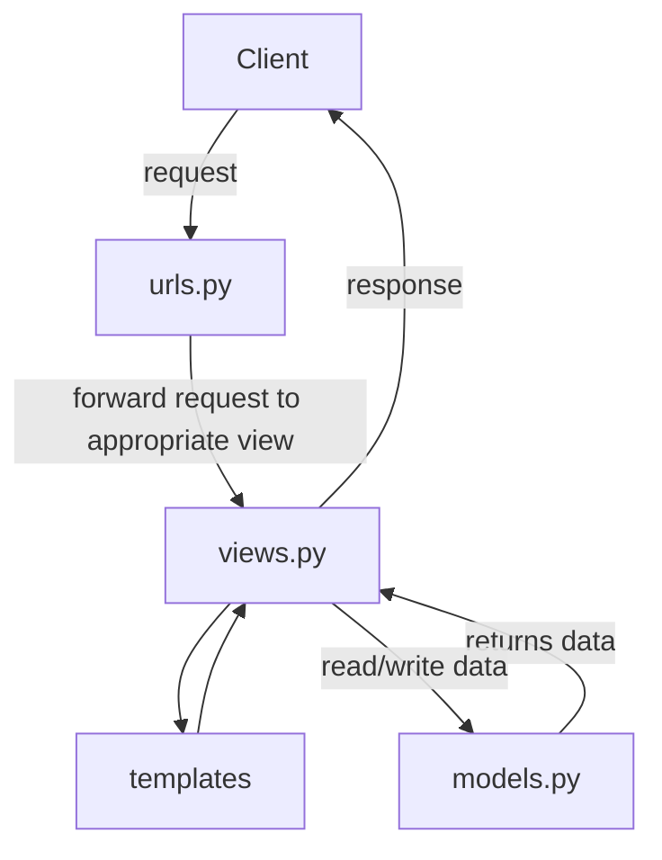

# Easy Shop

Proyek ini dibuat untuk memenuhi kebutuhan tugas mata kuliah Pemrograman Berbasis Platform. Proyek dibuat dengan menggunakan sistem operasi Windows

Link deployment PWS: http://muhammad-hibrizi-easyshop.pbp.cs.ui.ac.id

Jika link tidak dapat diakses, coba untuk membukanya dalam mode incognito dan pastikan url yang dimasukkan adalah http dan bukan https

Dibuat oleh Muhammad Hibrizi Farghana - 2306165585

<details>
<summary><h2><b>Tugas 2</b> (click to expand)</h2></summary>

### Proses Pengimplementasian Checklist Proyek

- Membuat sebuah proyek Django baru.

  1. Membuat direktori baru dengan nama `easy-shop`
  2. Membuat virtual environtment pada direktori tersebut dengan menjalankan perintah
     ```
     python -m venv env
     ```
  3. Mengaktifkan virtual environtment dengan perintah
     ```
     env\Scripts\activate
     ```
  4. Di dalam direktori yang sama, membuat file requirements.txt yang mengandung dependencies yang diperlukan. Isi requirements.txt:
     ```
     django
     gunicorn
     whitenoise
     psycopg2-binary
     requests
     urllib3
     ```
  5. Menginstall dependencies dengan menjalankan perintah
     ```
     pip install -r requirements.txt
     ```
  6. Membuat proyek Django baru `easy_shop` dengan menjalankan perintah
     ```
     django-admin startproject easy_shop .
     ```
  7. Di dalam direktori proyek `easy_shop`, akan ditemukan file `settings.py`. Agar proyek dapat dijalankan secara lokal, maka perlu ditambahkan string `"localhost"` dan `"127.0.0.1"` ke dalam list `ALLOWED_HOST` yang berada pada `settings.py`. List `ALLOWED_HOST` akan berisi sebagai berikut
     ```python
     ...
     ALLOWED_HOSTS = ["localhost", "127.0.0.1"]
     ...
     ```
     Setelah menjalankan steps-steps tersebut, proyek django baru dengan nama `easy_shop` telah berhasil dibuat dan dapat dijalankan secara lokal dengan menjalankan perintah berikut pada direktori utama (pastikan virtual environtment aktif):
     ```
     python manage.py runserver
     ```

- Membuat aplikasi `main` pada proyek tersebut

  1. Menjalankan perintah berikut pada direktori utama `easy-shop`, (pastikan virtual environtment aktif):
     ```
     python manage.py startapp main
     ```
  2. Menambahkan aplikasi `main` ke list `INSTALLED_APPS` pada file `settings.py` di direktori proyek `easy_shop`. List `INSTALLED_APPS` kini berisi sebagai berikut:
     ```python
     INSTALLED_APPS = [
         ...,
         'main'
     ]
     ```
     Aplikasi `main` telah berhasil dibuat dan didaftarkan ke proyek `easy_shop`

- Melakukan routing pada proyek agar dapat menjalankan aplikasi `main`

  1. Buka file `urls.py` yang berada di direktori proyek `easy_shop`
  2. Mengimpor fungsi `include` dari `django.urls`. Fungsi `include` dibutuhkan agar dapat melakukan impor rute URL dari aplikasi lain ke `urls.py` pada proyek
  3. Menambahkan rute URL `''` untuk mengarahkan ke tampilan `main` di dalam list `urlpatterns`. List tersebut akan berisi seperti berikut:
     ```python
     urlpatterns = [
         path('admin/', admin.site.urls),
         path('', include('main.urls')),
     ]
     ```
     Aplikasi main kini telah terhubung dengan rute URL proyek

- Membuat model pada aplikasi `main` dengan nama `Product`

  1. Buka file `models.py` pada direktori aplikasi `main`
  2. Membuat class dengan nama `Product` dan diisi dengan atribut wajib `name`, `price`, dan `description` sesuai dengan tipe datanya masing-masing. Saya juga menambahkan atribut tambahan berupa `stock` yang saya beri tipe data `IntegerField`. Isi dari `models.py` adalah sebagai berikut:
     ```python
     class Product(models.Model):
         name = models.CharField(max_length=255)
         price = models.IntegerField()
         description = models.TextField()
         stock = models.IntegerField()
     ```
  3. Membuat migrasi model dengan menjalankan perintah:
     ```
     python manage.py makemigrations
     ```
  4. Menerapkan migrasi dengan menjalankan perintah:
     ```
     python manage.py migrate
     ```
     Model telah berhasil dibuat dan dimigrasi

- Membuat sebuah fungsi pada views.py untuk dikembalikan ke dalam sebuah template HTML

  1. Membuat direktori baru bernama `templates` pada direktori aplikasi `main`
  2. Membuat file HTML baru bernama `main.html` pada direktori `templates`.
  3. Menambahkan kode berikut ke dalam file `main.html`

     ```html
     <!DOCTYPE html>
     <html lang="en">
       <head>
         <meta charset="UTF-8" />
         <meta
           name="viewport"
           content="width=device-width, initial-scale=1.0"
         />
         <title>Document</title>
       </head>
       <body>
         <h1>{{appname}}</h1>
         <h3>Nama</h3>
         <p>{{nama}}</p>
         <h3>Kelas</h3>
         <p>{{kelas}}</p>
       </body>
     </html>
     ```

  4. Menambahkan fungsi baru pada file `views.py` yang berada pada direktori aplikasi `main`.

     ```python
     def show_main(request):
         context = {
               'appname' : 'Easy Shop',
               'nama': 'Muhammad Hibrizi Farghana',
               'kelas': 'PBP A'
         }

         return render(request, "main.html", context)
     ```

     Fungsi untuk me-_render_ laman main telah berhasil dibuat

- Membuat sebuah routing pada `urls.py` aplikasi `main`

  1. Membuat file `urls.py` pada direktori aplikasi `main`
  2. Menambahkan kode berikut ke dalam file `urls.py`

     ```python
     from django.urls import path
     from main.views import show_main

     app_name = 'main'

     urlpatterns = [
         path('', show_main, name='show_main'),
     ]
     ```

     Routing telah berhasil dikonfigurasi

- Melakukan deployment ke PWS
  1. Membuka laman https://pbp.cs.ui.ac.id
  2. Membuat proyek baru dengan menekan tombol `+ Create New Project` kemudian mengisi nama proyek sebagai `easyshop`. Setelah itu, dilanjutkan dengan menekan tombol `Create New Project`.
  3. Menyalin username dan password yang telah diberikan dan kemudian saya simpan pada sebuah file `.txt` di laptop saya.
  4. Menambahkan URL PWS ke dalam list `ALLOWED_HOST` yang berada dalam file `settings.py` pada direktori proyek `easy_shop`. List `ALLOWED_HOST` kini berisi sebagai berikut:
     ```python
     ALLOWED_HOSTS = ["localhost", "127.0.0.1", "muhammad-hibrizi-easyshop.pbp.cs.ui.ac.id"]
     ```
  5. Menjalankan perintah yang berada di PWS
     ```
        git remote add pws http://pbp.cs.ui.ac.id/muhammad.hibrizi/easyshop
        git branch -M master
        git push pws master
     ```
     Proyek telah berhasil di-_deploy_ dengan menggunakan PWS

### Bagan Request Client ke Web Aplikasi Django



### Fungsi git dalam pengembangan perangkat lunak

Git memiliki banyak manfaat dalam pengembangan perangkat lunak. Dari sekian banyak manfaat git, ada 4 manfaat yang saya pikir menjadi alasan terpenting mengapa git digunakan dalam pengembangan perangkat lunak

1. **Version Control**

   Git memungkinkan pengembang untuk menyimpan dan melacak setiap perubahan yang dibuat pada kode. Dengan demikian, pengembang dapat melacak dan kembali ke versi-versi sebelumnya jika diperlukan.

2. **Kolaborasi**

   Git memudahkan pengembang untuk berkolaborasi. Dengan fitur seperti git clone, setiap pengembang dapat saling berkontribusi dan mengembangkan proyek yang terdapat pada Github/Gitlab. Selain itu, terdapat fitur seperti pull request dan merge request yang dapat dengan mudah mengintegrasikan kode dari banyak pengembang.

3. **Branching**

   Branching adalah fitur pada git yang memperbolehkan suatu repository untuk memiliki berbagai cabang / _branch_ yang terpisah dari satu sama yang lainnya. Dengan demikian, masing-masing pengembang dapat fokus mengembangkan suatu fitur di satu _branch_ tanpa takut menggganggu / merusak kode yang berada pada _branch_ utama.

4. **History**

   Git menyimpan histori lengkap dari setiap perubahan yang terjadi pada proyek. Setiap commit mencatat detail perubahan, siapa yang melakukan perubahan, dan kapan perubahan itu dilakukan. Dengan adanya histori ini, pengembang dapat melihat bagaimana sebuah proyek berkembang seiring waktu, dan dapat melacak atau mengembalikan kesalahan dengan mudah. Fitur seperti git log memudahkan untuk melihat jejak histori ini.

### Mengapa framework Django dijadikan permulaan pembelajaran pengembangan perangkat lunak?

1. **Python**

   Framework Django menggunakan bahasa Python. Bahasa Python adalah salah satu bahasa pemrograman yang paling _beginner friendly_ dan populer dikalangan pengembang. Oleh karena itu, penggunaan framework Django cocok digunakan karena menggunakan Python.

2. **Arsitektur Model-View-Template (MVT)**

   Django menggunakan arsitektur MVT yang memisahkan logika bisnis, tampilan, dan data dengan cara yang rapi dan terstruktur. Ini membantu pemula memahami prinsip-prinsip pemrograman yang baik seperti pemisahan kepentingan (separation of concerns), yang sangat penting dalam pengembangan perangkat lunak skala besar.

3. **Dokumentasi yang Komprehensif**

   Django memiliki dokumentasi yang lengkap dan komprehensif yang mudah untuk dipahami pemula. Selain itu, terdapat banyak sekali sumber di internet yang membahas dan menggunakan django sebagai tutorial dalam pembuatan web. Dengan demikian, pemula dapat dengan mudah mengeksplorasi dan memperbaiki masalah yang dialami ketika menggunakan Django.

### Mengapa model pada Django disebut sebagai ORM?

ORM adalah singkatan dari Object Relational Mapping. ORM atau Object Relational Mapping adalah teknik yang memungkinkan kita untuk berinteraksi dengan database menggunakan objek-objek dalam kode. ORM mengabstraksi detail-detail teknis tentang bagaimana data disimpan dan diambil, sehingga kita bisa fokus pada logika aplikasi tanpa harus memahami query SQL yang kompleks.

Dalam Django, model adalah representasi dari tabel di database, dan setiap instance dari model tersebut adalah representasi dari baris di tabel. Django ORM memungkinkan kita untuk menulis logika interaksi database menggunakan Python, tanpa perlu menulis SQL secara manual. ORM di Django otomatis mengonversi operasi yang dilakukan pada model menjadi query SQL yang sesuai dan mengirimkannya ke database.

Inilah sebabnya mengapa model di Django disebut sebagai ORM. Django bertindak sebagai penghubung antara objek Python dan database relasional sehingga memungkinkan pengembang untuk bekerja di tingkat yang lebih tinggi tanpa harus berinteraksi langsung dengan SQL.

</details>

<details>
<summary><h2><b>Tugas 3</b> (click to expand)</h2></summary>

### Mengapa kita memerlukan _data delivery_ dalam pengimplementasian sebuah _platform_?

_Data delivery_ diperlukan untuk memastikan bahwa data yang dihasilkan oleh _platform_ dapat ditransfer secara efisien dan aman antara sistem-sistem yang terlibat. Hal ini mencakup pengiriman data antar modul internal, serta pertukaran informasi dengan pengguna atau sistem eksternal. Tanpa mekanisme _data delivery_ yang baik, _platform_ akan kesulitan dalam menyediakan layanan yang responsif karena data tidak dapat diakses atau diterima tepat waktu.

### Mana yang lebih baik antara XML dan JSON? Mengapa JSON lebih populer dibandingkan XML?

Baik XML maupun JSON memiliki kegunaannya masing-masing, tetapi JSON lebih banyak dipilih karena lebih sederhana, lebih ringan, dan lebih mudah dibaca oleh manusia maupun mesin. JSON memiliki sintaks yang lebih ringkas dan juga memudahkan pengolahan data di berbagai bahasa pemrograman. Di sisi lain, meskipun XML fleksibel dan mendukung struktur data yang lebih kompleks, tetapi XML dianggap lebih berat dan mengandung lebih banyak informasi yang mungkin tidak dibutuhkan. Oleh karena itu lah JSON lebih populer dibanding XML, terutama dalam aplikasi berbasis web dan API.

### Fungsi dari method is_valid() pada form Django dan mengapa kita membutuhkan method tersebut?

Method `is_valid()` pada form Django digunakan untuk memeriksa apakah data yang dimasukkan pengguna sesuai dengan aturan validasi yang telah ditentukan. Method ini memastikan bahwa input, seperti tipe data dan batasan lainnya, memenuhi kriteria yang ditetapkan agar data dapat diproses lebih lanjut atau disimpan ke dalam basis data. Tanpa validasi yang memadai, aplikasi bisa menerima data yang tidak valid atau berbahaya, yang berpotensi menimbulkan kesalahan atau menjadi sumber celah keamanan.

### csrf_token

- **Mengapa kita membutuhkan `csrf_token` saat membuat form di Django?**

  `csrf_token` digunakan sebagai mekanisme keamanan untuk melindungi aplikasi Django dari serangan Cross-Site Request Forgery (CSRF). Token ini memastikan bahwa setiap permintaan yang dikirim melalui form berasal dari sumber yang valid, yaitu dari aplikasi atau situs yang sama. Dengan menambahkan `csrf_token` ke dalam form, Django dapat memverifikasi bahwa permintaan tidak datang dari sumber eksternal yang berbahaya sehingga mencegah tindakan yang tidak diinginkan seperti manipulasi data oleh pihak ketiga.

- **Apa yang dapat terjadi jika kita tidak menambahkan `csrf_token` pada form Django?**

  Jika kita tidak menambahkan `csrf_token` pada form di Django, aplikasi menjadi rentan terhadap serangan CSRF. Penyerang dapat mengeksploitasi kerentanan ini dengan mengirimkan permintaan palsu atas nama pengguna yang sedang login tanpa sepengetahuan mereka. Hal ini dapat mengakibatkan data yang dimasukkan pengguna atau tindakan tertentu dijalankan secara tidak sah oleh aplikasi.

- **Bagaimana hal tersebut dapat dimanfaatkan oleh penyerang?**

  Penyerang dapat memanfaatkan celah ini dengan membuat halaman web atau skrip berbahaya yang ketika dikunjungi oleh pengguna, secara otomatis mengirimkan permintaan ke aplikasi Django tanpa persetujuan atau pengetahuan pengguna. Misalnya, penyerang dapat memaksa pengguna untuk mengirimkan permintaan pengubahan data sensitif, seperti mengganti kata sandi atau melakukan transaksi, dengan memanfaatkan sesi yang aktif. Tanpa perlindungan CSRF, aplikasi tidak akan dapat membedakan antara permintaan yang valid dan yang berbahaya.

### Implementasi Checklist secara step-by-step

- **Membuat input form untuk menambahkan objek model pada app sebelumnya.**

1. Membuat direktori baru bernama `templates` pada direktori utama

2. Dalam direktori `templates` di direktori utama, membuat sebuah file `base.html`. Isi dari `base.html` adalah sebagai berikut:

   ```django
   

   <!DOCTYPE html>
   <html lang="en">
      <head>
         <meta charset="UTF-8" />
         <meta name="viewport" content="width=device-width, initial-scale=1.0" />
          
      </head>

   <body>
       
   </body>
   </html>
   ```

3. Pada direktori `templates` di direktori `main`, memodifikasi `main.html` dengan kode sebagai berikut:

   ```django
   
   
   <h1>{{appname}}</h1>
   <h3>Nama</h3>
   <p>{{nama}}</p>
   <h3>Kelas</h3>
   <p>{{kelas}}</p>
   
   ```

4. Memodifikasi `models.py` agar memiliki id dengan menggunakan library `uuid`

   ```python
   import uuid # Menambahkan library uuid
   ...
   class Product(models.Model):
      id = models.UUIDField(primary_key=True, default=uuid.uuid4, editable=False) # Membuat id
      ...
   ```

5. Melakukan migrasi model dengan perintah
   ```
   python manage.py makemigrations
   python manage.py migrate
   ```
6. Membuat file baru `forms.py` pada direkori `main`, kemudian membuat struktur form pada file tersebut yang diberi nama `ProductEntryForm`. Adapun kkodenya adalah sebagai berikut:

   ```python
   from django.forms import ModelForm
   from main.models import Product

   class ProductEntryForm(ModelForm):
   class Meta:
      model = Product
      fields = ["name", "price", "description", "stock"]
   ```

7. Pada file `views.py` di direktori `main`, mengimpor method `redirect`, class `ProductEntryForm`, class `Product` dan membuat function baru `create_product_entry` untuk menghasilkan form yang dapat menambahkan data product.

   ```python
   from django.shortcuts import render, redirect
   from main.forms import ProductEntryForm
   from main.models import Product

   def create_product_entry(request):
      form = ProductEntryForm(request.POST or None)

      if form.is_valid() and request.method == "POST":
      form.save()
      return redirect('main:show_main')

      context = {'form': form}
      return render(request, "create_product_entry.html", context)
   ```

8. Menambahkan data produk-produk ke `views.py`

   ```python
   from main.models import Product

   def show_main(request):
      product_entries = Product.objects.all() # Mengambil data produk
      context = {
         'appname' : 'Easy Shop',
         'nama': 'Muhammad Hibrizi Farghana',
         'kelas': 'PBP A',
         'product_entries': product_entries, # Menampilkan data produk
      }

    return render(request, "main.html", context)
   ```

9. Menambahkan path baru untuk laman menambahkan produk

   ```python
   ...
   from main.views import show_main, create_product_entry # Mengimpor fungsi form menambah product
   ...
   urlpatterns = [
      ...
      path('create-product-entry', create_product_entry, name='create_product_entry'), # Menambahkan path ini
   ]
   ```

10. Membuat file html baru bernama `create_product_entry.html` yang isinya sebagai berikut:

    ```django
    
    
    <h1>Add New Product</h1>

    <form method="POST">
    
    <table>
       {{ form.as_table }}
       <tr>
          <td></td>
          <td>
          <input type="submit" value="Add Product" />
          </td>
       </tr>
    </table>
    </form>

    
    ```

11. Pada `main.html` di direktori templates `main`, menambahkan kode berikut agar produk dapat dilihat user

    ```django
    
       <p>Produk belum tersedia.</p>
    
       <table>
          <tr>
             <th>Product Name</th>
             <th>Price</th>
             <th>Description</th>
             <th>Stock</th>
          </tr>

          
             <tr>
             <td>{{product.name}}</td>
             <td>{{product.price}}</td>
             <td>{{product.description}}</td>
             <td>{{product.stock}}</td>
             </tr>
          
       </table>
    

       <br />

       <a href="">
          <button>Add New Product</button>
       </a>
    
    ```

- **Membuat 4 fungsi views baru untuk melihat objek yang sudah ditambahkan**

1. Dalam direktori `main`, menambahkan dua import baru

   ```python
   from django.http import HttpResponse
   from django.core import serializers
   ```

2. Membuat fungsi yang mengembalikan data dalam format XML
   ```python
   def show_xml(request):
    data = Product.objects.all()
    return HttpResponse(serializers.serialize("xml", data), content_type="application/xml")
   ```
3. Membuat fungsi yang mengembalikan data dalam format JSON

   ```python
   def show_json(request):
    data = Product.objects.all()
    return HttpResponse(serializers.serialize("json", data), content_type="application/json")
   ```

4. Membuat fungsi yang mengembalikan data dalam format XML by id

   ```python
   def show_xml_by_id(request, id):
    data = Product.objects.filter(pk=id)
    return HttpResponse(serializers.serialize("xml", data), content_type="application/xml")
   ```

5. Membuat fungsi yang mengembalikan data dalam format JSON by id
   ```python
   def show_json_by_id(request, id):
    data = Product.objects.filter(pk=id)
    return HttpResponse(serializers.serialize("json", data), content_type="application/json")
   ```
6. Dalam direktori `main`, memodifikasi `urls.py` agar melakukan routings untuk 4 fungsi sebelumnya, `urls.py` kini menjadi sebagai berikut:

   ```python
   from django.urls import path
   from main.views import show_main, create_product_entry, show_xml, show_json, show_xml_by_id, show_json_by_id

   app_name = 'main'

   urlpatterns = [
      path('', show_main, name='show_main'),
      path('create-product-entry', create_product_entry, name='create_product_entry'),
      path('xml/', show_xml, name='show_xml'),
      path('json/', show_json, name='show_json'),
      path('xml/<str:id>/', show_xml_by_id, name='show_xml_by_id'),
      path('json/<str:id>/', show_json_by_id, name='show_json_by_id'),
   ]
   ```

### Screenshot Postman

1. **JSON**
   

2. **JSON by ID**
   

3. **XML**
   

4. **XML by ID**
   

</details>

<details>
<summary><h2><b>Tugas 4</b> (click to expand)</h2></summary>

## Implementasi Checklist secara step-by-step

### Mengimplementasikan fungsi registrasi, login, dan logout

1. Menambahkan _import-import_ berikut pada `views.py` di direktori aplikasi main

   ```python
   from django.contrib.auth.forms import UserCreationForm, AuthenticationForm
   from django.contrib.auth.decorators import login_required
   from django.contrib.auth import authenticate, login, logout
   from django.contrib import messages
   ```

2. Menambahkan fungsi `register`

   ```python
   def register(request):
      form = UserCreationForm()

      if request.method == "POST":
         form = UserCreationForm(request.POST)
         if form.is_valid():
               form.save()
               messages.success(request, 'Your account has been successfully created!')
               return redirect('main:login')

      context = {'form':form}
      return render(request, 'register.html', context)
   ```

3. Menambahkan fungsi `login_user`

   ```python
   def login_user(request):
      if request.method == 'POST':
         form = AuthenticationForm(data=request.POST)

         if form.is_valid():
               user = form.get_user()
               login(request, user)
               return redirect('main:show_main')

      else:
         form = AuthenticationForm(request)

      context = {'form': form}
      return render(request, 'login.html', context)
   ```

4. Menambahkan fungsi `logout`

   ```python
   def logout_user(request):
      logout(request)
      return redirect('main:login')
   ```

5. Pada `templates` di direktori aplikasi `main`, menambahkan file html baru `register.html`
   ```django
   
   
   <title>Register</title>
   
   
   <div class="login">
      <h1>Register</h1>
      <form method="POST">
         
         <table>
            {{ form.as_table }}
            <tr>
            <td></td>
            <td><input type="submit" name="submit" value="Daftar" /></td>
            </tr>
         </table>
      </form>
      
      <ul>
         
         <li>{{ message }}</li>
         
      </ul>
      
   </div>
   
   ```
6. Pada `templates` di direktori aplikasi main, menambahkan file html baru `login.html`

   ```django
   
   
   <title>Login</title>
   
   
   <div class="login">
      <h1>Login</h1>
      <form method="POST" action="">
         
         <table>
            {{ form.as_table }}
            <tr>
            <td></td>
            <td><input class="btn login_btn" type="submit" value="Login" /></td>
            </tr>
         </table>
      </form>
      
      <ul>
         
         <li>{{ message }}</li>
         
      </ul>
       Don't have an account yet?
      <a href="">Register Now</a>
   </div>
   
   ```

7. Agar user perlu login sebelum mengakses halaman utama, menambahkan decorator `@login_required` sebelum fungsi show main

```python
...
@login_required(login_url='/login')
def show_main(request):
   ...
...
```

8. Melakukan routings pada fungsi-fungsi sebelumnya dengan melakukan modifikasi di `urls.py` direktori aplikasi `main`

   ```python
   from django.urls import path
   from main.views import *   # Import semua di views.py aplikasi main

   app_name = 'main'

   urlpatterns = [
      ...
      path('register/', register, name="register"),  # menambahkan path register
      path('login/', login_user, name='login'),      # menambahkan path login
      path('logout/', logout_user, name='logout')    # menambahkan path logout
   ]
   ```

### Membuat dua akun pengguna dengan masing-masing tiga dummy data

1. Menjalankan perintah berikut untuk mengaktifkan _local server_

   ```
   python manage.py runserver
   ```

2. Membuka url `localhost:8000`
3. Menekan teks _register now_
4. Memasukkan data akun baru kemudian klik tombol daftar
5. Melakukan langkah 3 dan 4 satu kali lagi untuk membuat dua akun
6. Login ke akun pertama
7. Menekan tombol `Add New Product` dan memasukkan dummy data produk kemudian menekan tombol `Add Product`
8. Mengulangi langkah ke-7 hingga ada 3 dummy data produk
9. Melakukan logout dengan menekan tombol `logout`
10. Login ke akun kedua kemudian melakukan hal yang sama pada langkah ke-7 hingga ke-9

### Menghubungkan model `Product` dengan` User`

1.  Menambahkan _import-import_ berikut pada file `models.py` di direktori aplikasi `main`

    ```python
    from django.contrib.auth.models import User
    ```

2.  Pada class `Product`, menambahkan line berikut
    ```python
    ...
    class Product(models.Model):
       user = models.ForeignKey(User, on_delete=models.CASCADE) # Tambahkan
       ...
    ```
3.  Pada file `views.py` aplikasi `main`, mengubah variabel `product_entries`

    ```python
    ...
    def show_main(request):
       product_entries = Product.objects.filter(user=request.user) # Ubah menjadi seperti ini
       ...
    ```

4.  Pada function `create_product_entry`, modifikasi kode dalam blok if

    ```python
    def create_product_entry(request):
      form = ProductEntryForm(request.POST or None)

      if form.is_valid() and request.method == "POST":
         product_entries = form.save(commit=False)
         product_entries.user = request.user
         product_entries.save()
         return redirect('main:show_main')
      ...
    ```

### Menampilkan detail informasi pengguna yang sedang logged in seperti username dan menerapkan `cookies`

1. Pada `views.py` aplikasi `main`, menambahkan _import-import_ berikut

   ```python
   import datetime
   from django.http import HttpResponse, HttpResponseRedirect
   from django.urls import reverse
   ```

2. Pada fungsi `login_user`, memodifikasi kode dalam blok `if form.is_valid()` menjadi seperti berikut:

   ```python
   def login_user(request):
      if request.method == 'POST':
         form = AuthenticationForm(data=request.POST)

         if form.is_valid():
               user = form.get_user()
               login(request, user)
               response = HttpResponseRedirect(reverse("main:show_main"))
               response.set_cookie('last_login', str(datetime.datetime.now()))
               return response
         ...
   ```

3. Memodifikasi fungsi `logout_user`

   ```python
   def logout_user(request):
      logout(request)
      response = HttpResponseRedirect(reverse('main:login'))
      response.delete_cookie('last_login')
      return response
   ```

4. Mengubah value `nama` pada variabel `context` di fungsi `show_main` dan menambahkan `last_login`

   ```python
   def show_main(request):
      product_entries = Product.objects.filter(user=request.user)
      context = {
         'appname' : 'Easy Shop',
         'nama': request.user.username, # ubah jadi request.user.username
         'kelas': 'PBP A',
         'product_entries': product_entries,
         'last_login': request.COOKIES['last_login'], # Menambahkan last_login
      }
   ```

5. Menambahkan kode berikut dalam file `main.html` di `templates` aplikasi main, setelah tombol _logout_

   ```django
   ...
   <h5>Sesi terakhir login: {{ last_login }}</h5>
   ...
   ```

6. Melakukan migrasi model dengan perintah `python manage.py makemigrations`. Setelah menjalankan perintah tersebut akan diminta input, masukkan semua input dengan `1`. Setelah itu migrasi dengan `python manage.py migrate`

## Perbedaan antara HttpResponseRedirect() dan redirect()

Dari dokumentasi Django, fungsi `redirect()`sebenarnya mengembalikan `HttpResponseRedirect` kepada URL yang dimasukkan juga, tetapi fungsi `redirect()` juga dapat menerima _argument_ model dan view. Hal ini berbeda dengan `HttpResponseRedirect` yang hanya menerima _argument_ URL. Jadi, fungsi `redirect()` adalah versi yang lebih "fleksibel" dari `HttpResponseRedirect` karena dapat menerima lebih banyak jenis _argument_.

## Cara kerja penghubungan model Product dengan User!

Penghubungan model `Product` dengan `User` dilakukan melalui penggunaan _foreign key_. Dengan menambahkan _field_ `user = models.ForeignKey(User, on_delete=models.CASCADE)` pada suatu model, model tersebut akan menjadi terhubung dengan user. _foreign key_ memungkinkan setiap produk dikaitkan dengan pengguna yang telah terdaftar dalam sistem. Dengan _foreign key_, kita bisa mengetahui siapa pengguna yang membuat atau memiliki produk tersebut, serta dapat melakukan filter produk berdasarkan pengguna.

## Perbedaan antara authentication dan authorization dan cara implementasinya oleh Django

_Authentication_ adalah proses verifikasi identitas pengguna, misalnya dengan username dan password, sedangkan _authorization_ menentukan apa yang boleh diakses oleh pengguna setelah identitasnya diverifikasi. Dalam Django, proses ini dilakukan menggunakan fungsi `authenticate()` dan `login()` yang tersedia dalam modul `django.contrib.auth`. Metode `authenticate()` menerima kredensial dan kemudian memvalidasinya. Jika valid, fungsi akan mengembalikan objek User yang sesuai. Setelah pengguna telah terverifikasi, metode `login()` digunakan untuk memulai sesi pengguna dengan menyimpan informasinya dalam `request`. Untuk _authorization_, Django telah menyediakan _permissions_ yang bisa diatur untuk sebuah objek. Dengan menggunakan method `has_view_permission()`, `has_add_permission()`, `has_change_permission()` dan `has_delete_permission()`pada class `ModelAdmin`, hal ini memungkinkan untuk memberikan _authorization_ sesuai dengan user yang kita inginkan.

## Bagaimana Django mengingat pengguna yang telah login?

Django mengingat pengguna yang telah login dengan menggunakan sesi yang disimpan dalam `cookies`. Setiap kali pengguna mengakses halaman baru, Django memeriksa `cookies` untuk melihat apakah ada sesi yang aktif. Selain untuk sesi login, `cookies` juga dapat digunakan untuk menyimpan preferensi pengguna, melacak aktivitas pengguna, atau untuk menyimpan data sementara. Akan tetapi, tidak semua `cookies` aman digunakan. `Cookies` yang tidak dienkripsi atau tidak diberi perlindungan tambahan, berpotensi untuk terkena serangan, seperti _cross-site scripting_ (XSS) atau pencurian data.

</details>

<details>
<summary><h2><b>Tugas 5</b> (click to expand)</h2></summary>

## Implementasi Checklist secara step-by-step

### Implementasikan fungsi untuk menghapus dan mengedit product.

1. Pada file `views.py` dalam direktori `main`, menambahkan 2 fungsi berikut

   ```python
   def edit_product(request, id):
      product = Product.objects.get(pk=id)
      form = ProductEntryForm(request.POST or None, instance=product)

      if form.is_valid() and request.method == "POST":
         form.save()
         return HttpResponseRedirect(reverse('main:show_main'))

      context = {'form': form}
      return render(request, "edit_product.html", context)

   def delete_product(request, id):
      product = Product.objects.get(pk=id)
      product.delete()
      return HttpResponseRedirect(reverse('main:show_main'))
   ```

2. Pada `urls.py` di direktori `main`, menambahkan _routing_ untuk kedua fungsi sebelumnya

   ```python
   urlpatterns = [
      ...
      path('edit-product/<uuid:id>', edit_product, name='edit_product'),
      path('delete/<uuid:id>', delete_product, name='delete_product'),
      ...
   ]
   ```

### Kustomisasi desain pada template HTML

1. Menambahkan _script tailwind_ dan _font custom_ pada `base.html`

   ```html
   <script src="https://cdn.tailwindcss.com"></script>
   <link rel="preconnect" href="https://fonts.googleapis.com" />
   <link rel="preconnect" href="https://fonts.gstatic.com" crossorigin />
   <link
     href="https://fonts.googleapis.com/css2?family=Poppins:ital,wght@0,100;0,200;0,300;0,400;0,500;0,600;0,700;0,800;0,900;1,100;1,200;1,300;1,400;1,500;1,600;1,700;1,800;1,900&display=swap"
     rel="stylesheet"
   />
   ```

2. Mengkustomisasi bagian _body_ `base.html` untuk menampilkan _background_ sesuai gaya yang saya inginkan

3. Mengkustomisasi `login.html`, `register.html`, `main.html`, `create_product.html`, dan `edit_product.html`, sesuai dengan gaya yang saya inginkan dengan mengkustomiasasi bagian `class` dari tag html yang ingin diberi gaya

4. Pada `main.html`, akan menampilkan sebuah gambar/gif, jika belum ada product. Hal ini saya capai dengan menambahkan tag ``

5. Menampilkan detail produk dengan membuat sebuah _card_. Hal ini saya capai dengan membungkus detail produk dalam suatu elemen `<div></div>` yang kemudian saya beri gaya dengan _tailwind_

6. Pada tiap _card_ produk, menambahkan tombol _edit_ dan _delete_ melalui tag `<a></a>` dengan kustomisasi yang saya inginkan.

### Membuat navbar

1. Membuat file `navbar.html` pada direktori `templates` di root folder

2. Menambahkan kode html dan class _tailwind_ yang saya inginkan untuk navbar.

3. Memastikan navbar responsif melalui _chrome developer tools_

4. Menambahkan navbar pada `main.html`, `create_product.html`, dan `edit_product.html` dengan _template tag_ django ``

## Urutan prioritas pengambilan CSS _selector_

Urutan prioritas pengambilan CSS selector dilihat dari nilai _specificity_. Selector dengan nilai _specificity_ lebih tinggi lah yang akan terlebih dahulu diterapkan gayanya.

Ada 4 kategori yang mendefinisikan _specificity_ CSS _selector_

1. Inline styles - contoh: `<h1 style="color: pink;">`
2. IDs - Contoh: `#navbar`
3. Classes, pseudo-classes, attribute selectors - contoh: `.test, :hover, [href]`
4. Elements and pseudo-elements - contoh: `h1, ::before`

Berikut adalah langkah untuk menghitung nilai _specificity_.

Mulai dari 0, tambahkan 100 untuk setiap nilai ID, tambahkan 10 untuk setiap nilai _class_ (atau pemilih _pseudo class_ atau selektor atribut), tambahkan 1 untuk setiap selektor elemen atau _pseudo element_.
Jika terdapat nilai _specificity_ yang sama, maka aturan yang paling akhir ditulis lah yang berlaku.

Catatan:
Inline style mendapatkan nilai _specificity_ 1000 dan selalu diberikan prioritas tertinggi. Akan tetapi, terdapay pengecualian pada aturan ini jika diterapkan aturan `important!`.

## Mengapa _responsive design_ penting

_Responsive design_ penting agar dapat memberikan pengalaman yang terbaik untuk setiap pengguna. Tanpa _responsive design_, beberapa pengguna mungkin akan kesulitan menggunakan aplikasi karena tampilan yang tidak sesuai dengan perangkat mereka. Akibatnya, jumlah pengguna aplikasi bisa menurun karena pengalaman yang kurang memadai.

Contoh aplikasi yang telah menerapkan _responsive design_ : YouTube / https://www.youtube.com

Contoh aplikasi yang belum menerapkan _responsive design_ : SIAK NG / https://academic.ui.ac.id

## _margin_, _border_, dan _padding_

Margin adalah atribut CSS yang mengatur jarak suatu elemen html di luar _bordernya_

Implementasi:

```css
target-element {
  margin: 25px 50px 75px 100px;
}
```

Border adalah atribut CSS yang mengatur bagian terluar dari suatu elemen html

Implementasi:

```css
target-element {
  border: 5px solid red;
}
```

Padding adalah atribut CSS yang mengatur jarak konten html / _child_ elemen html terhadap _border parentnya_ sendiri

Implementasi:

```css
target-element {
  margin: 25px 50px 75px 100px;
}
```

## _flex box_ dan _grid layout_

_Flex box_ dan _grid layout_ adalah dua teknik CSS yang digunakan untuk mengatur _layout_ elemen dalam halaman web.

_Flex box_ adalah model _layout_ satu dimensi untuk mengatur elemen-elemen html pada satu baris ataupun kolom. Hal ini membuat _flex box_ sangat berguna dalam membuat _layout_ seperti _navbar_ dan sejenisnya.

_Grid layout_ adalah model layout dua dimensi untuk mengatur elemen-elemen html pada suatu _grid_ dengan jumlah baris dan kolom tertentu. Berbeda dengan _flex box_ yang hanya dapat mengatur elemen dalam sebuah kolom dan baris, _grid_ dapat mengatur elemen untuk diposisikan pada suatu grid di baris dan kolom yang kita inginkan. Hal ini membuat _flex box_ sangat berguna dalam membuat _layout_ seperti Mondrian _art_ dan sebagainya.

</details>

<details>
<summary><h2><b>Tugas 6</b> (click to expand)</h2></summary>

## Implementasi Checklist secara step-by-step

### Ubahlah kode cards data product agar dapat mendukung AJAX GET

1. Membuat file `card_product.html` di direktori `main/templates`.
2. Menyalin kode yang berfungsi sebagai card di dalam `main.html` ke file `card.product.html`
3. Menghapus _template tags if_ yang berada di `main.html` dan diganti dengan `<div id="product_entry_cards"></div>`
4. Di bagian paling bawah file `main.html`, membuat tag script yang nantinya akan diisi kode-kode penting

### Buatlah sebuah tombol yang membuka sebuah modal dengan form untuk menambahkan product.

1. Membuat file baru bernama `modal.html` di direktori `main/templates`.
2. Mengisi file `modal.html` dengan kode untuk modal
3. Di `main.html`, menambahkan button berikut tepat di bawah elemen html tombol original.

```html
<button
  data-modal-target="crudModal"
  data-modal-toggle="crudModal"
  class="btn bg-[#489CC1] text-sm w-64 text-white rounded-lg px-6 py-2 font-bold hover:bg-blue-100 hover:text-[#489CC1] transition duration-200 ease-in-out cursor-pointer"
  onclick="showModal();"
>
  Add New Product by AJAX
</button>
```

4. Di bagian script, menambahkan fungsionalitas buka tutup modal dengan fungsi `showModal()` dan `hideModal()` kemudian dihubungkan ke _event listener_ tombol-tombol yang bersesuaian.

### Buatlah fungsi view baru untuk menambahkan product baru ke dalam basis data.

1. Megimpor hal-hal berikut pada file `views.py` di direktori `main`

```python
from django.http import JsonResponse
from django.views.decorators.csrf import csrf_exempt
from django.views.decorators.http import require_POST
from django.utils.html import strip_tags
```

2. Membuat fungsi baru bernama `add_product_ajax()` yang isinya sebagai berikut

```python
@csrf_exempt
@require_POST
def add_product_ajax(request):
    name = strip_tags(request.POST.get("name"))
    price = request.POST.get("price")
    description = strip_tags(request.POST.get("description"))
    stock= request.POST.get("stock")
    user = request.user

    if not name or not description:
        return JsonResponse({
            'status': 'ERROR',
            'errors': {
                'name': 'Name cannot be blank.' if not name else '',
                'description': 'Description cannot be blank.' if not description else ''
            }
        }, status=400)

    new_product = Product(
        name=name, price=price,
        description=description,
        stock=stock, user=user
    )
    new_product.save()

    return JsonResponse({
        'status': 'CREATED',
        'name': name,
        'description': description
    }, status=201)
```

3. Di dalam `forms.py` direktori `main`, menambahkan dua fungsi `clean_name()` dan `clean_description()`

### Buatlah path /create-ajax/ yang mengarah ke fungsi view yang baru kamu buat.

Di dalam `urls.py` direktori `main`, menambahkan `path('create-ajax/', add_product_ajax, name='create_ajax'),` ke url patterns

### Hubungkan form yang telah kamu buat di dalam modal kamu ke path /create-ajax/

Di bagian script `main.html` menambahkan kode berikut

```javascript
function addProductEntry() {
  function removeErrorMessages() {
    document.querySelectorAll(".error-message").forEach((error) => {
      error.remove();
    });
  }

  fetch("", {
    method: "POST",
    body: new FormData(document.querySelector("#productEntryForm")),
  })
    .then((response) => {
      return response.json().then((data) => ({
        status: response.status,
        body: data,
      }));
    })
    .then(({ status, body }) => {
      removeErrorMessages();
      if (status === 201) {
        refreshProductEntries();
        document.getElementById("productEntryForm").reset();
        hideModal();
      } else if (status === 400) {
        if (body.errors.name) {
          let nameField = document.getElementById("name");
          let errorMessage = document.createElement("p");
          errorMessage.className = "text-red-500 text-sm mt-1 error-message";
          errorMessage.textContent = body.errors.name;
          nameField.parentNode.appendChild(errorMessage);
        }
        if (body.errors.description) {
          let descriptionField = document.getElementById("description");
          let errorMessage = document.createElement("p");
          errorMessage.className = "text-red-500 text-sm mt-1 error-message";
          errorMessage.textContent = body.errors.description;
          descriptionField.parentNode.appendChild(errorMessage);
        }
      } else {
        console.error("Error adding product entry:", body);
      }
    })
    .catch((error) => {
      console.error("Network error:", error);
    });
}

document.getElementById("productEntryForm").addEventListener("submit", (e) => {
  e.preventDefault();
  addProductEntry();
});
```

### Lakukan refresh pada halaman utama secara asinkronus untuk menampilkan daftar product terbaru tanpa reload halaman utama secara keseluruhan.

Di dalam tag script di file `main.html`, menambahkan kode sebagai berikut

```javascript
async function getProductEntries() {
  return fetch("").then((res) => res.json());
}
async function refreshProductEntries() {
  document.getElementById("product_entry_cards").innerHTML = "";
  document.getElementById("product_entry_cards").className = "";
  const productEntries = await getProductEntries();
  let htmlString = "";
  let classNameString = "";

  if (productEntries.length === 0) {
    classNameString = "flex flex-col items-center justify-center";
    htmlString = `
      <p class="font-bold text-center mb-6">Produk belum tersedia 😢.</p>
      
      `;
  } else {
    classNameString =
      "grid grid-cols-1 md:grid-cols-2 lg:grid-cols-3 gap-4 p-4 break-words";
    productEntries.forEach((product) => {
      const name = DOMPurify.sanitize(product.fields.name);
      const description = DOMPurify.sanitize(product.fields.description);
      htmlString += `
           
        `;
    });
  }

  document.getElementById("product_entry_cards").className = classNameString;
  document.getElementById("product_entry_cards").innerHTML = htmlString;
}
refreshProductEntries();
```

## Manfaat JavaScript dalam pengembangan aplikasi web

JavaScript digunakan untuk menangani logika yang dibutuhkan dalam web. Hal ini dikarenakan HTML dan CSS bukanlah bahasa pemrograman sehingga keduanya tidak dapat menangani logika-logika seperti _if statements_, _looping_, dan sebagainya. Selain itu, JavaScript juga memungkinkan pengembang untuk menambahkan interaktivitas pada halaman web. Misalnya seperti membuat modal yang dapat dibuka dan ditutup, atau melakukan perubahan pada web tanpa dibutuhkan adanya _refresh_ halaman. Selain untuk interaktivitas, JavaScript juga dapat digunakan untuk mengambil dan mengolah data melalui sisi klien saja dengan fetch dan AJAX.

## Fungsi await ketika menggunakan fetch()

`await` digunakan agar data yang ingin diambil melalui fungsi `fetch()`, dapat diambil seluruhnya terlebih dahulu sebelum dapat dilanjutkan ke proses selanjutnya. Ketika ketika memanggil `await`, program akan berhenti sebentar untuk menunggu data yang ingin diambil.

### Apa yang akan terjadi jika kita tidak menggunakan await?

Apabila kita tidak menggunakan `await` ketika memanggil fungsi `fetch()`, maka bisa saja data yang ingin untuk ditampilkan tidak muncul karena program tidak menunggu agar keseluruhan data selesai diambil.

## Mengapa kita perlu menggunakan decorator csrf_exempt pada view yang akan digunakan untuk AJAX POST?

Kita perlu menggunakan decorator `@csrf_exempt` pada view yang digunakan untuk AJAX POST karena secara default Django menerapkan perlindungan CSRF (Cross-Site Request Forgery) pada setiap permintaan POST. Karena kita akan mengambil dan mengirim data via AJAX, django akan mengira permintaan ini adalah permintaan dari luar sehingga dianggap berbahaya dan permintaan akan diblokir. Untuk mencegah hal ini, kita menggunakan decorator `@csrf_exempt` agar django membiarkan kita melakukan permintaan melalui AJAX.

## Mengapa pembersihan data input pengguna dilakukan di belakang (backend), kenapa tidak dilakukan di frontend saja?

Jika kita hanya membersihkan data di frontend saja, meskipun nantinya pada klien tidak terjadi apa-apa, tetapi perlu diingat bahwa penyerangan csrf dapat menyisipkan skrip berbahaya yang menyerang kita dari bagian backend. Artinya, jika kita tidak membersihkan data di backend juga, maka skrip jahat yang disisipkan akan tetap bekerja dan dieksekusi di backend meskipun di frontend tidak terlihat apa-apa.

</details>
