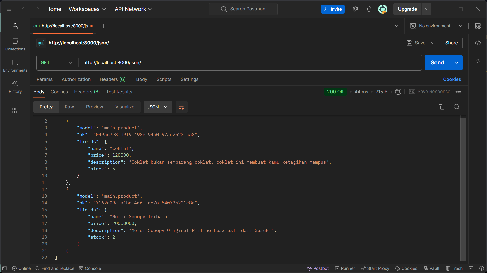

# Easy Shop

Proyek ini dibuat untuk memenuhi kebutuhan tugas mata kuliah Pemrograman Berbasis Platform. Proyek dibuat dengan menggunakan sistem operasi Windows

Link deployment PWS: http://muhammad-hibrizi-easyshop.pbp.cs.ui.ac.id

Jika link tidak dapat diakses, coba untuk membukanya dalam mode incognito dan pastikan url yang dimasukkan adalah http dan bukan https

Dibuat oleh Muhammad Hibrizi Farghana - 2306165585

<details>
<summary><h2><b>Tugas 2</b> (click to expand)</h2></summary>

### Proses Pengimplementasian Checklist Proyek

- Membuat sebuah proyek Django baru.

  1. Membuat direktori baru dengan nama `easy-shop`
  2. Membuat virtual environtment pada direktori tersebut dengan menjalankan perintah
     ```
     python -m venv env
     ```
  3. Mengaktifkan virtual environtment dengan perintah
     ```
     env\Scripts\activate
     ```
  4. Di dalam direktori yang sama, membuat file requirements.txt yang mengandung dependencies yang diperlukan. Isi requirements.txt:
     ```
     django
     gunicorn
     whitenoise
     psycopg2-binary
     requests
     urllib3
     ```
  5. Menginstall dependencies dengan menjalankan perintah
     ```
     pip install -r requirements.txt
     ```
  6. Membuat proyek Django baru `easy_shop` dengan menjalankan perintah
     ```
     django-admin startproject easy_shop .
     ```
  7. Di dalam direktori proyek `easy_shop`, akan ditemukan file `settings.py`. Agar proyek dapat dijalankan secara lokal, maka perlu ditambahkan string `"localhost"` dan `"127.0.0.1"` ke dalam list `ALLOWED_HOST` yang berada pada `settings.py`. List `ALLOWED_HOST` akan berisi sebagai berikut
     ```python
     ...
     ALLOWED_HOSTS = ["localhost", "127.0.0.1"]
     ...
     ```
     Setelah menjalankan steps-steps tersebut, proyek django baru dengan nama `easy_shop` telah berhasil dibuat dan dapat dijalankan secara lokal dengan menjalankan perintah berikut pada direktori utama (pastikan virtual environtment aktif):
     ```
     python manage.py runserver
     ```

- Membuat aplikasi `main` pada proyek tersebut

  1. Menjalankan perintah berikut pada direktori utama `easy-shop`, (pastikan virtual environtment aktif):
     ```
     python manage.py startapp main
     ```
  2. Menambahkan aplikasi `main` ke list `INSTALLED_APPS` pada file `settings.py` di direktori proyek `easy_shop`. List `INSTALLED_APPS` kini berisi sebagai berikut:
     ```python
     INSTALLED_APPS = [
         ...,
         'main'
     ]
     ```
     Aplikasi `main` telah berhasil dibuat dan didaftarkan ke proyek `easy_shop`

- Melakukan routing pada proyek agar dapat menjalankan aplikasi `main`

  1. Buka file `urls.py` yang berada di direktori proyek `easy_shop`
  2. Mengimpor fungsi `include` dari `django.urls`. Fungsi `include` dibutuhkan agar dapat melakukan impor rute URL dari aplikasi lain ke `urls.py` pada proyek
  3. Menambahkan rute URL `''` untuk mengarahkan ke tampilan `main` di dalam list `urlpatterns`. List tersebut akan berisi seperti berikut:
     ```python
     urlpatterns = [
         path('admin/', admin.site.urls),
         path('', include('main.urls')),
     ]
     ```
     Aplikasi main kini telah terhubung dengan rute URL proyek

- Membuat model pada aplikasi `main` dengan nama `Product`

  1. Buka file `models.py` pada direktori aplikasi `main`
  2. Membuat class dengan nama `Product` dan diisi dengan atribut wajib `name`, `price`, dan `description` sesuai dengan tipe datanya masing-masing. Saya juga menambahkan atribut tambahan berupa `stock` yang saya beri tipe data `IntegerField`. Isi dari `models.py` adalah sebagai berikut:
     ```python
     class Product(models.Model):
         name = models.CharField(max_length=255)
         price = models.IntegerField()
         description = models.TextField()
         stock = models.IntegerField()
     ```
  3. Membuat migrasi model dengan menjalankan perintah:
     ```
     python manage.py makemigrations
     ```
  4. Menerapkan migrasi dengan menjalankan perintah:
     ```
     python manage.py migrate
     ```
     Model telah berhasil dibuat dan dimigrasi

- Membuat sebuah fungsi pada views.py untuk dikembalikan ke dalam sebuah template HTML

  1. Membuat direktori baru bernama `templates` pada direktori aplikasi `main`
  2. Membuat file HTML baru bernama `main.html` pada direktori `templates`.
  3. Menambahkan kode berikut ke dalam file `main.html`

     ```html
     <!DOCTYPE html>
     <html lang="en">
       <head>
         <meta charset="UTF-8" />
         <meta
           name="viewport"
           content="width=device-width, initial-scale=1.0"
         />
         <title>Document</title>
       </head>
       <body>
         <h1>{{appname}}</h1>
         <h3>Nama</h3>
         <p>{{nama}}</p>
         <h3>Kelas</h3>
         <p>{{kelas}}</p>
       </body>
     </html>
     ```

  4. Menambahkan fungsi baru pada file `views.py` yang berada pada direktori aplikasi `main`.

     ```python
     def show_main(request):
         context = {
               'appname' : 'Easy Shop',
               'nama': 'Muhammad Hibrizi Farghana',
               'kelas': 'PBP A'
         }

         return render(request, "main.html", context)
     ```

     Fungsi untuk me-_render_ laman main telah berhasil dibuat

- Membuat sebuah routing pada `urls.py` aplikasi `main`

  1. Membuat file `urls.py` pada direktori aplikasi `main`
  2. Menambahkan kode berikut ke dalam file `urls.py`

     ```python
     from django.urls import path
     from main.views import show_main

     app_name = 'main'

     urlpatterns = [
         path('', show_main, name='show_main'),
     ]
     ```

     Routing telah berhasil dikonfigurasi

- Melakukan deployment ke PWS
  1. Membuka laman https://pbp.cs.ui.ac.id
  2. Membuat proyek baru dengan menekan tombol `+ Create New Project` kemudian mengisi nama proyek sebagai `easyshop`. Setelah itu, dilanjutkan dengan menekan tombol `Create New Project`.
  3. Menyalin username dan password yang telah diberikan dan kemudian saya simpan pada sebuah file `.txt` di laptop saya.
  4. Menambahkan URL PWS ke dalam list `ALLOWED_HOST` yang berada dalam file `settings.py` pada direktori proyek `easy_shop`. List `ALLOWED_HOST` kini berisi sebagai berikut:
     ```python
     ALLOWED_HOSTS = ["localhost", "127.0.0.1", "muhammad-hibrizi-easyshop.pbp.cs.ui.ac.id"]
     ```
  5. Menjalankan perintah yang berada di PWS
     ```
        git remote add pws http://pbp.cs.ui.ac.id/muhammad.hibrizi/easyshop
        git branch -M master
        git push pws master
     ```
     Proyek telah berhasil di-_deploy_ dengan menggunakan PWS

### Bagan Request Client ke Web Aplikasi Django


### Fungsi git dalam pengembangan perangkat lunak

Git memiliki banyak manfaat dalam pengembangan perangkat lunak. Dari sekian banyak manfaat git, ada 4 manfaat yang saya pikir menjadi alasan terpenting mengapa git digunakan dalam pengembangan perangkat lunak

1. **Version Control**

   Git memungkinkan pengembang untuk menyimpan dan melacak setiap perubahan yang dibuat pada kode. Dengan demikian, pengembang dapat melacak dan kembali ke versi-versi sebelumnya jika diperlukan.

2. **Kolaborasi**

   Git memudahkan pengembang untuk berkolaborasi. Dengan fitur seperti git clone, setiap pengembang dapat saling berkontribusi dan mengembangkan proyek yang terdapat pada Github/Gitlab. Selain itu, terdapat fitur seperti pull request dan merge request yang dapat dengan mudah mengintegrasikan kode dari banyak pengembang.

3. **Branching**

   Branching adalah fitur pada git yang memperbolehkan suatu repository untuk memiliki berbagai cabang / _branch_ yang terpisah dari satu sama yang lainnya. Dengan demikian, masing-masing pengembang dapat fokus mengembangkan suatu fitur di satu _branch_ tanpa takut menggganggu / merusak kode yang berada pada _branch_ utama.

4. **History**

   Git menyimpan histori lengkap dari setiap perubahan yang terjadi pada proyek. Setiap commit mencatat detail perubahan, siapa yang melakukan perubahan, dan kapan perubahan itu dilakukan. Dengan adanya histori ini, pengembang dapat melihat bagaimana sebuah proyek berkembang seiring waktu, dan dapat melacak atau mengembalikan kesalahan dengan mudah. Fitur seperti git log memudahkan untuk melihat jejak histori ini.

### Mengapa framework Django dijadikan permulaan pembelajaran pengembangan perangkat lunak?

1. **Python**

   Framework Django menggunakan bahasa Python. Bahasa Python adalah salah satu bahasa pemrograman yang paling _beginner friendly_ dan populer dikalangan pengembang. Oleh karena itu, penggunaan framework Django cocok digunakan karena menggunakan Python.

2. **Arsitektur Model-View-Template (MVT)**

   Django menggunakan arsitektur MVT yang memisahkan logika bisnis, tampilan, dan data dengan cara yang rapi dan terstruktur. Ini membantu pemula memahami prinsip-prinsip pemrograman yang baik seperti pemisahan kepentingan (separation of concerns), yang sangat penting dalam pengembangan perangkat lunak skala besar.

3. **Dokumentasi yang Komprehensif**

   Django memiliki dokumentasi yang lengkap dan komprehensif yang mudah untuk dipahami pemula. Selain itu, terdapat banyak sekali sumber di internet yang membahas dan menggunakan django sebagai tutorial dalam pembuatan web. Dengan demikian, pemula dapat dengan mudah mengeksplorasi dan memperbaiki masalah yang dialami ketika menggunakan Django.

### Mengapa model pada Django disebut sebagai ORM?

ORM adalah singkatan dari Object Relational Mapping. ORM atau Object Relational Mapping adalah teknik yang memungkinkan kita untuk berinteraksi dengan database menggunakan objek-objek dalam kode. ORM mengabstraksi detail-detail teknis tentang bagaimana data disimpan dan diambil, sehingga kita bisa fokus pada logika aplikasi tanpa harus memahami query SQL yang kompleks.

Dalam Django, model adalah representasi dari tabel di database, dan setiap instance dari model tersebut adalah representasi dari baris di tabel. Django ORM memungkinkan kita untuk menulis logika interaksi database menggunakan Python, tanpa perlu menulis SQL secara manual. ORM di Django otomatis mengonversi operasi yang dilakukan pada model menjadi query SQL yang sesuai dan mengirimkannya ke database.

Inilah sebabnya mengapa model di Django disebut sebagai ORM. Django bertindak sebagai penghubung antara objek Python dan database relasional sehingga memungkinkan pengembang untuk bekerja di tingkat yang lebih tinggi tanpa harus berinteraksi langsung dengan SQL.

</details>

<details>
<summary><h2><b>Tugas 3</b> (click to expand)</h2></summary>

### Mengapa kita memerlukan _data delivery_ dalam pengimplementasian sebuah _platform_?

_Data delivery_ diperlukan untuk memastikan bahwa data yang dihasilkan oleh _platform_ dapat ditransfer secara efisien dan aman antara sistem-sistem yang terlibat. Hal ini mencakup pengiriman data antar modul internal, serta pertukaran informasi dengan pengguna atau sistem eksternal. Tanpa mekanisme _data delivery_ yang baik, _platform_ akan kesulitan dalam menyediakan layanan yang responsif karena data tidak dapat diakses atau diterima tepat waktu.

### Mana yang lebih baik antara XML dan JSON? Mengapa JSON lebih populer dibandingkan XML?

Baik XML maupun JSON memiliki kegunaannya masing-masing, tetapi JSON lebih banyak dipilih karena lebih sederhana, lebih ringan, dan lebih mudah dibaca oleh manusia maupun mesin. JSON memiliki sintaks yang lebih ringkas dan juga memudahkan pengolahan data di berbagai bahasa pemrograman. Di sisi lain, meskipun XML fleksibel dan mendukung struktur data yang lebih kompleks, tetapi XML dianggap lebih berat dan mengandung lebih banyak informasi yang mungkin tidak dibutuhkan. Oleh karena itu lah JSON lebih populer dibanding XML, terutama dalam aplikasi berbasis web dan API.

### Fungsi dari method is_valid() pada form Django dan mengapa kita membutuhkan method tersebut?

Method `is_valid()` pada form Django digunakan untuk memeriksa apakah data yang dimasukkan pengguna sesuai dengan aturan validasi yang telah ditentukan. Method ini memastikan bahwa input, seperti tipe data dan batasan lainnya, memenuhi kriteria yang ditetapkan agar data dapat diproses lebih lanjut atau disimpan ke dalam basis data. Tanpa validasi yang memadai, aplikasi bisa menerima data yang tidak valid atau berbahaya, yang berpotensi menimbulkan kesalahan atau menjadi sumber celah keamanan.

### csrf_token

- **Mengapa kita membutuhkan `csrf_token` saat membuat form di Django?**

  `csrf_token` digunakan sebagai mekanisme keamanan untuk melindungi aplikasi Django dari serangan Cross-Site Request Forgery (CSRF). Token ini memastikan bahwa setiap permintaan yang dikirim melalui form berasal dari sumber yang valid, yaitu dari aplikasi atau situs yang sama. Dengan menambahkan `csrf_token` ke dalam form, Django dapat memverifikasi bahwa permintaan tidak datang dari sumber eksternal yang berbahaya sehingga mencegah tindakan yang tidak diinginkan seperti manipulasi data oleh pihak ketiga.

- **Apa yang dapat terjadi jika kita tidak menambahkan `csrf_token` pada form Django?**

  Jika kita tidak menambahkan `csrf_token` pada form di Django, aplikasi menjadi rentan terhadap serangan CSRF. Penyerang dapat mengeksploitasi kerentanan ini dengan mengirimkan permintaan palsu atas nama pengguna yang sedang login tanpa sepengetahuan mereka. Hal ini dapat mengakibatkan data yang dimasukkan pengguna atau tindakan tertentu dijalankan secara tidak sah oleh aplikasi.

- **Bagaimana hal tersebut dapat dimanfaatkan oleh penyerang?**

  Penyerang dapat memanfaatkan celah ini dengan membuat halaman web atau skrip berbahaya yang ketika dikunjungi oleh pengguna, secara otomatis mengirimkan permintaan ke aplikasi Django tanpa persetujuan atau pengetahuan pengguna. Misalnya, penyerang dapat memaksa pengguna untuk mengirimkan permintaan pengubahan data sensitif, seperti mengganti kata sandi atau melakukan transaksi, dengan memanfaatkan sesi yang aktif. Tanpa perlindungan CSRF, aplikasi tidak akan dapat membedakan antara permintaan yang valid dan yang berbahaya.

### Implementasi Checklist secara step-by-step

- **Membuat input form untuk menambahkan objek model pada app sebelumnya.**

1. Membuat direktori baru bernama `templates` pada direktori utama

2. Dalam direktori `templates` di direktori utama, membuat sebuah file `base.html`. Isi dari `base.html` adalah sebagai berikut:

   ```django
   

   <!DOCTYPE html>
   <html lang="en">
      <head>
         <meta charset="UTF-8" />
         <meta name="viewport" content="width=device-width, initial-scale=1.0" />
          
      </head>

   <body>
       
   </body>
   </html>
   ```

3. Pada direktori `templates` di direktori `main`, memodifikasi `main.html` dengan kode sebagai berikut:

   ```django
   
   
   <h1>{{appname}}</h1>
   <h3>Nama</h3>
   <p>{{nama}}</p>
   <h3>Kelas</h3>
   <p>{{kelas}}</p>
   
   ```

4. Memodifikasi `models.py` agar memiliki id dengan menggunakan library `uuid`

   ```python
   import uuid # Menambahkan library uuid
   ...
   class Product(models.Model):
      id = models.UUIDField(primary_key=True, default=uuid.uuid4, editable=False) # Membuat id
      ...
   ```

5. Melakukan migrasi model dengan perintah
   ```
   python manage.py makemigrations
   python manage.py migrate
   ```
6. Membuat file baru `forms.py` pada direkori `main`, kemudian membuat struktur form pada file tersebut yang diberi nama `ProductEntryForm`. Adapun kkodenya adalah sebagai berikut:

   ```python
   from django.forms import ModelForm
   from main.models import Product

   class ProductEntryForm(ModelForm):
   class Meta:
      model = Product
      fields = ["name", "price", "description", "stock"]
   ```

7. Pada file `views.py` di direktori `main`, mengimpor method `redirect`, class `ProductEntryForm`, class `Product` dan membuat function baru `create_product_entry` untuk menghasilkan form yang dapat menambahkan data product.

   ```python
   from django.shortcuts import render, redirect
   from main.forms import ProductEntryForm
   from main.models import Product

   def create_product_entry(request):
      form = ProductEntryForm(request.POST or None)

      if form.is_valid() and request.method == "POST":
      form.save()
      return redirect('main:show_main')

      context = {'form': form}
      return render(request, "create_product_entry.html", context)
   ```

8. Menambahkan data produk-produk ke `views.py`

   ```python
   from main.models import Product

   def show_main(request):
      product_entries = Product.objects.all() # Mengambil data produk
      context = {
         'appname' : 'Easy Shop',
         'nama': 'Muhammad Hibrizi Farghana',
         'kelas': 'PBP A',
         'product_entries': product_entries, # Menampilkan data produk
      }

    return render(request, "main.html", context)
   ```

9. Menambahkan path baru untuk laman menambahkan produk

   ```python
   ...
   from main.views import show_main, create_product_entry # Mengimpor fungsi form menambah product
   ...
   urlpatterns = [
      ...
      path('create-product-entry', create_product_entry, name='create_product_entry'), # Menambahkan path ini
   ]
   ```

10. Membuat file html baru bernama `create_product_entry.html` yang isinya sebagai berikut:

    ```django
    
    
    <h1>Add New Product</h1>

    <form method="POST">
    
    <table>
       {{ form.as_table }}
       <tr>
          <td></td>
          <td>
          <input type="submit" value="Add Product" />
          </td>
       </tr>
    </table>
    </form>

    
    ```

11. Pada `main.html` di direktori templates `main`, menambahkan kode berikut agar produk dapat dilihat user

    ```django
    
       <p>Produk belum tersedia.</p>
    
       <table>
          <tr>
             <th>Product Name</th>
             <th>Price</th>
             <th>Description</th>
             <th>Stock</th>
          </tr>

          
             <tr>
             <td>{{product.name}}</td>
             <td>{{product.price}}</td>
             <td>{{product.description}}</td>
             <td>{{product.stock}}</td>
             </tr>
          
       </table>
    

       <br />

       <a href="">
          <button>Add New Product</button>
       </a>
    
    ```

- **Membuat 4 fungsi views baru untuk melihat objek yang sudah ditambahkan**

1. Dalam direktori `main`, menambahkan dua import baru

   ```python
   from django.http import HttpResponse
   from django.core import serializers
   ```

2. Membuat fungsi yang mengembalikan data dalam format XML
   ```python
   def show_xml(request):
    data = Product.objects.all()
    return HttpResponse(serializers.serialize("xml", data), content_type="application/xml")
   ```
3. Membuat fungsi yang mengembalikan data dalam format JSON

   ```python
   def show_json(request):
    data = Product.objects.all()
    return HttpResponse(serializers.serialize("json", data), content_type="application/json")
   ```

4. Membuat fungsi yang mengembalikan data dalam format XML by id

   ```python
   def show_xml_by_id(request, id):
    data = Product.objects.filter(pk=id)
    return HttpResponse(serializers.serialize("xml", data), content_type="application/xml")
   ```

5. Membuat fungsi yang mengembalikan data dalam format JSON by id
   ```python
   def show_json_by_id(request, id):
    data = Product.objects.filter(pk=id)
    return HttpResponse(serializers.serialize("json", data), content_type="application/json")
   ```
6. Dalam direktori `main`, memodifikasi `urls.py` agar melakukan routings untuk 4 fungsi sebelumnya, `urls.py` kini menjadi sebagai berikut:

   ```python
   from django.urls import path
   from main.views import show_main, create_product_entry, show_xml, show_json, show_xml_by_id, show_json_by_id

   app_name = 'main'

   urlpatterns = [
      path('', show_main, name='show_main'),
      path('create-product-entry', create_product_entry, name='create_product_entry'),
      path('xml/', show_xml, name='show_xml'),
      path('json/', show_json, name='show_json'),
      path('xml/<str:id>/', show_xml_by_id, name='show_xml_by_id'),
      path('json/<str:id>/', show_json_by_id, name='show_json_by_id'),
   ]
   ```

### Screenshot Postman

1. **JSON**
   

2. **JSON by ID**
   

3. **XML**
   

4. **XML by ID**
   

</details>
